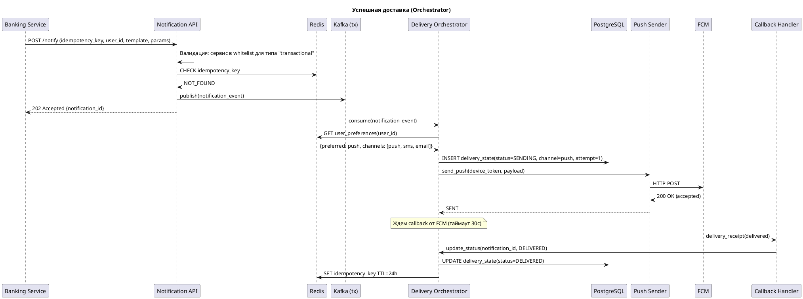
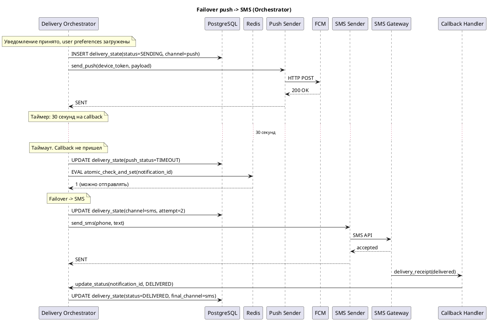
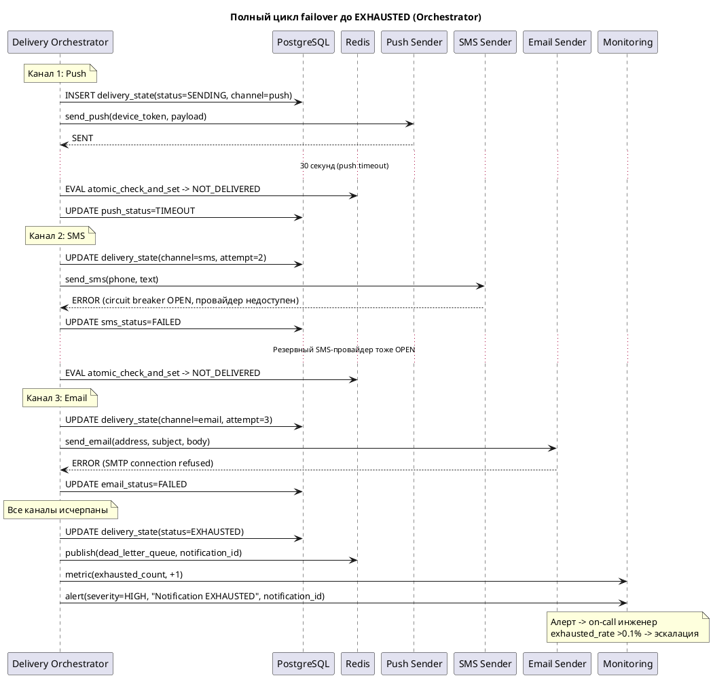

# RFC: Гарантированная доставка критичных уведомлений с кросс-канальным failover

| Метаданные          | Значение   |
| ------------------- | ---------- |
| **Статус**          | DRAFT      |
| **Автор(ы)**        | -          |
| **Ответственный**   | -          |
| **Бизнес-заказчик** | -          |
| **Ревьюеры**        | -          |
| **Дата создания**   | 2025-04-07 |
| **Дата обновления** | 2025-04-07 |

---

## Оглавление

1. [Контекст](#контекст)
2. [Продуктовый анализ](#продуктовый-анализ)
3. [Пользовательские сценарии](#пользовательские-сценарии)
4. [Статистика](#статистика)
5. [Требования](#требования)
6. [Варианты решения](#варианты-решения)
7. [Сравнительный анализ](#сравнительный-анализ)
8. [Выводы](#выводы)
9. [Приложения](#приложения)

---

## Контекст

Онлайн-банк строит централизованную Notification Platform взамен разрозненных решений команд
Этот RFC про один из самых сложных кусков платформы: подсистему гарантированной доставки транзакционных уведомлений с автоматическим failover между каналами

Транзакционные уведомления (подтверждение перевода, списание средств, одноразовые коды) критичны по двум причинам
Первая: безопасность. Пользователь должен мгновенно узнать о любой операции с его деньгами
Вторая: регуляторика и доверие. Если подтверждение перевода не дошло, пользователь звонит в поддержку, пишет жалобу, теряет доверие к банку

Сейчас каждая команда шлет уведомления сама. Push может не дойти (пользователь отключил уведомления в ОС), а fallback на SMS никто не делает. Или делает, но по-своему, без контроля дублей

### Ключевые вопросы

- Как гарантировать, что критичное уведомление дойдет хотя бы через один канал (push / SMS / email)?
- Как переключаться между каналами автоматически, не дублируя сообщение?
- Как минимизировать затраты на SMS (самый дорогой канал), не жертвуя надежностью?
- Как обеспечить наблюдаемость процесса доставки от приема до подтверждения?

### Кто затронут

- Пользователи банка (10 млн MAU) - получатели уведомлений
- Внутренние команды (платежи, кредиты, карты) - отправители, переходят на единый API
- SRE/on-call - мониторят подсистему, реагируют на инциденты
- Бизнес - отвечает за retention (+15%) и снижение жалоб (-30%)

---

## Продуктовый анализ

Подсистема гарантированной доставки напрямую влияет на три бизнес-метрики

**Retention.** Цель +15%. Транзакционные уведомления (подтверждение перевода, статус списания) формируют ощущение контроля над деньгами. Если уведомление не дошло, пользователь чувствует что банк ненадежен. Retention - доля пользователей, возвращающихся в продукт. Гарантированная доставка не единственный фактор, но ее отсутствие - прямой kill-фактор: пользователь, не получивший подтверждение списания, с высокой вероятностью уйдет в банк, где "хотя бы SMS приходят"

**Жалобы на уведомления.** Цель -30%. Текущие проблемы: дубли (одно и то же 2-3 раза), задержки (подтверждение перевода приходит через минуты), пропуски (не дошло вообще). Все три сценария генерируют обращения в поддержку. Failover с дедупликацией закрывает пропуски и дубли, приоритизация транзакционных - задержки

**Conversion (косвенно).** Конверсия в покупку зависит от доверия к банку. Пользователь, который видит подтверждение операции за секунды, охотнее совершает следующую. Прямой метрики нет, но каскадный эффект через retention измерим

**LTV.** Lifetime Value растет с retention: чем дольше пользователь в банке, тем больше продуктов он оформляет (кредиты, карты, вклады). Каждый потерянный пользователь - недополученный LTV. При средних 12 транзакциях в месяц и среднем чеке комиссии ~15 руб, LTV одного активного пользователя за год - ~2 160 руб. Потеря 1% DAU (30 000 пользователей) из-за проблем с уведомлениями - ~65 млн руб/год недополученного дохода

---

## Пользовательские сценарии

| Приоритет   | Тип сценария                  | Действующее лицо | Сценарий                                                                                                                                                              |
| ----------- | ----------------------------- | ---------------- | --------------------------------------------------------------------------------------------------------------------------------------------------------------------- |
| MUST HAVE   | Успешная доставка             | Пользователь     | Пользователь совершает перевод. Платформа отправляет push. FCM подтверждает доставку. Пользователь видит уведомление                                                  |
| MUST HAVE   | Failover push -> SMS          | Пользователь     | Push не доставлен за 30 секунд (устройство офлайн). Платформа автоматически отправляет SMS                                                                            |
| MUST HAVE   | Failover push -> SMS -> email | Пользователь     | Push не доставлен, SMS-провайдер недоступен. Платформа отправляет email как последний канал                                                                           |
| MUST HAVE   | Дедупликация при failover     | Пользователь     | Push отправлен, но callback от FCM пришел с задержкой. Платформа уже запустила failover на SMS. Перед отправкой SMS проверяет статус - push доставлен. SMS отменяется |
| MUST HAVE   | Настройки каналов             | Пользователь     | Пользователь отключил push в настройках банка. Платформа начинает цепочку failover сразу с SMS, минуя push. Транзакционные уведомления целиком отключить нельзя       |
| SHOULD HAVE | Мониторинг доставки           | SRE-инженер      | Инженер видит в дашборде что delivery rate по push упал ниже 90% за последние 5 минут. Срабатывает алерт                                                              |
| SHOULD HAVE | Массовый сбой провайдера      | SRE-инженер      | SMS-провайдер упал полностью. Платформа автоматически перенаправляет весь SMS-трафик на резервного провайдера. Алерт уходит в on-call                                 |
| COULD HAVE  | Аналитика стоимости           | Бизнес-аналитик  | Аналитик смотрит отчет: сколько уведомлений ушло по каждому каналу, какова стоимость SMS за период, какой процент failover-ов                                         |

---

## Статистика

### Масштаб системы

- MAU: 10 млн пользователей
- DAU: 3 млн пользователей
- Peak Concurrent Users: 300 000

### Расчет нагрузки на подсистему транзакционных уведомлений

Средний объем: 3 млн DAU x 2 транзакционных/день = 6 млн транзакционных уведомлений в день

Распределение по времени неравномерное. Примерно 70% трафика приходится на 8 активных часов (10:00-18:00), а внутри них есть пиковый час (зарплатные дни, обед) с ~15% дневного объема

```
Средний RPS (активные часы): 6 000 000 x 0.7 / (8 x 3600) = ~146 RPS
Пиковый RPS (час пик):       6 000 000 x 0.15 / 3600      = ~250 RPS
С запасом x2 на рост:                                       = ~500 RPS
```

Для транзакционных 500 RPS - целевой пик. Маркетинговые и сервисные сюда не входят, они идут по отдельным очередям

При failover каждое недоставленное уведомление генерирует дополнительную попытку (SMS или email). Если push delivery rate ~80%, то ~20% уведомлений пойдут в failover, дополнительно ~100 RPS к SMS/email-провайдерам в пик

### Стоимость SMS

Средняя стоимость транзакционного SMS через агрегатор - ~2.5 руб (ориентир: прайсы Devino Telecom, SMS.ru, BSG на 2025 г., точная цена зависит от объема и контракта)
Если 20% транзакционных уходят в SMS-failover: 6 000 000 x 0.2 x 2.5 = 3 000 000 руб/день, примерно 90 млн руб/мес
Много. Поэтому минимизация ложных failover-ов - не просто оптимизация, а бизнес-необходимость

---

## Требования

### Функциональные требования

| №   | Приоритет   | Обозначение | Требование                                                                                                                                                                                                                                                                                                  |
| --- | ----------- | ----------- | ----------------------------------------------------------------------------------------------------------------------------------------------------------------------------------------------------------------------------------------------------------------------------------------------------------- |
| 1   | MUST HAVE   | FR1         | Прием транзакционного уведомления через единый API с указанием получателя, типа операции и параметров для шаблона. Ответ - подтверждение приема с идентификатором уведомления                                                                                                                               |
| 2   | MUST HAVE   | FR2         | Последовательный failover по цепочке каналов (push -> SMS -> email). При неподтвержденной доставке по текущему каналу за отведенный таймаут - автоматический переход на следующий                                                                                                                           |
| 3   | MUST HAVE   | FR3         | Дедупликация: перед каждой попыткой отправки проверяется, не доставлено ли уведомление по другому каналу. Idempotency_key предотвращает повторную обработку одного и того же запроса                                                                                                                        |
| 4   | MUST HAVE   | FR4         | Учет пользовательских настроек: если пользователь отключил push, цепочка начинается с SMS. Транзакционные уведомления нельзя отключить полностью, только выбрать предпочитаемый канал                                                                                                                       |
| 5   | MUST HAVE   | FR5         | Отслеживание статуса каждой попытки доставки: отправлено, доставлено, не доставлено, таймаут. Callback от провайдеров обновляет статус                                                                                                                                                                      |
| 6   | MUST HAVE   | FR6         | Валидация типа уведомления при приеме. Каждый сервис-отправитель зарегистрирован в платформе с whitelist-ом разрешенных типов (например, сервис платежей может слать транзакционные, но не маркетинговые). Не дает командам пометить маркетинговую рассылку как транзакционную ради failover-а и приоритета |
| 7   | SHOULD HAVE | FR7         | Автоматическое переключение на резервного провайдера того же канала, если основной деградирует (error rate выше порога за скользящее окно)                                                                                                                                                                  |
| 8   | SHOULD HAVE | FR8         | Dashboard для мониторинга: delivery rate по каналам, latency, количество failover-ов, стоимость SMS за период                                                                                                                                                                                               |
| 9   | COULD HAVE  | FR9         | "Тихие часы" для SMS: ночью (23:00-07:00 по локальному времени пользователя) email вместо SMS для экономии и UX. Часовой пояс берется из профиля пользователя. Не распространяется на операции безопасности (подозрительная активность)                                                                     |

### Нефункциональные требования

| №   | Приоритет   | Обозначение | Требование                                                                                                                                 |
| --- | ----------- | ----------- | ------------------------------------------------------------------------------------------------------------------------------------------ |
| 1   | MUST HAVE   | NFR1        | Latency обработки на платформе <=500ms (p95) от приема запроса до передачи провайдеру. End-to-end <=5 сек (p95) с учетом ответа провайдера |
| 2   | MUST HAVE   | NFR2        | Пропускная способность: 500 RPS транзакционных в пике (с запасом x2 от текущих расчетов)                                                   |
| 3   | MUST HAVE   | NFR3        | Доступность 99.95% для приема транзакционных уведомлений (примерно 22 мин простоя/мес)                                                     |
| 4   | MUST HAVE   | NFR4        | Потеря транзакционных уведомлений внутри платформы не более 0.01% (1 из 10 000)                                                            |
| 5   | MUST HAVE   | NFR5        | Шифрование персональных данных при хранении и передаче. Соответствие PCI DSS для карточных данных                                          |
| 6   | SHOULD HAVE | NFR6        | Время обнаружения инцидента <=5 мин. MTTR для критичных инцидентов <=30 мин. Distributed tracing с единым correlation ID                   |
| 7   | SHOULD HAVE | NFR7        | Хранение истории доставки за 90 дней (для разбора жалоб и аналитики)                                                                       |

### Архитектурно значимые требования (ASR)

**ASR-1: Низкая задержка обработки (<=500ms p95 на платформе)**
Связанные требования: FR1, FR2, NFR1, NFR2
Влияние на архитектуру: асинхронная обработка, минимум синхронных операций на hot path. Прием -> быстро в очередь -> ответ. Обработка отдельно

**ASR-2: Гарантированная доставка с failover и защитой от дублей**
Связанные требования: FR2, FR3, FR4, FR5, NFR4
Влияние на архитектуру: stateful-процесс (конечный автомат) для каждого уведомления, персистентное хранилище статусов, таймеры failover, идемпотентность на каждом шаге. Без этого ASR можно обойтись fire-and-forget

**ASR-3: Наблюдаемость с MTTR <=30 минут**
Связанные требования: FR5, FR8, NFR6
Влияние на архитектуру: correlation ID через все компоненты, отдельный observability-стек (метрики, трейсинг, алертинг), который не зависит от основной инфраструктуры

### Детали механизма доставки

Тут собраны вопросы, которые неизбежно возникнут при обсуждении архитектуры. Лучше ответить на них в одном месте, чем размазывать по вариантам решения

**Конечный автомат (FSM) уведомления:**

```
                         ┌─────────────┐
                         │   CREATED   │
                         └──────┬──────┘
                                │ определен первый канал
                                ▼
                         ┌─────────────┐
                    ┌────│   SENDING   │────┐
                    │    │  (channel=X)│    │
                    │    └──────┬──────┘    │
                    │           │           │
              провайдер     callback      таймаут
              отклонил     delivered     (channel timeout)
                    │           │           │
                    │           ▼           │
                    │    ┌─────────────┐    │
                    │    │  DELIVERED  │    │
                    │    └─────────────┘    │
                    │                       │
                    ▼                       ▼
              ┌─────────────┐       ┌─────────────┐
              │   FAILED    │       │   TIMEOUT   │
              │  (channel=X)│       │  (channel=X)│
              └──────┬──────┘       └──────┬──────┘
                     │                     │
                     └──────┬──────────────┘
                            │ есть следующий канал?
                     ┌──────┴──────┐
                     │ Да          │ Нет
                     ▼             ▼
              ┌─────────────┐ ┌──────────┐
              │   SENDING   │ │ EXHAUSTED│
              │ (channel=Y) │ └──────────┘
              └─────────────┘
```

Состояние хранится в PostgreSQL. Каждый переход - отдельная запись в таблице `delivery_attempts`, плюс обновление текущего статуса в основной записи. Это и аудит, и возможность восстановить полную картину

**Обоснование таймаутов:**

Push (30 секунд). FCM/APNs при онлайн-устройстве возвращают callback за 1-5 сек. 30 секунд покрывают случай кратковременной потери сети (метро, лифт). Слишком короткий таймаут (5-10 сек) вызовет массовые ложные failover-ы на SMS, а каждый ложный failover стоит ~2.5 руб. Слишком длинный (2-5 мин) - пользователь ждет подтверждение перевода и нервничает. 30 секунд - граница, после которой вероятность доставки push резко падает. Конкретное значение калибруется после пилота

SMS (60 секунд). Delivery receipt от SMS-агрегатора обычно приходит за 5-30 сек, но при перегрузке оператора задержки доходят до минуты. 60 секунд - разумный порог. После таймаута - переход на email

Email (не ждем receipt). Email delivery receipt ненадежен: pixel tracking блокируется почтовыми клиентами, а SMTP acceptance не равно доставке в inbox. Если email-провайдер принял сообщение (SMTP 250) - считаем что сделали все возможное. Если SMTP вернул ошибку - уведомление переходит в EXHAUSTED

**Терминальное состояние EXHAUSTED (все каналы исчерпаны):**

Если push, SMS и email не сработали - уведомление получает статус EXHAUSTED. Дальше:

1. Автоматический алерт в on-call (severity: high). Массовый EXHAUSTED - признак системного сбоя
2. Уведомление попадает в dead letter queue для ручного разбора
3. Метрика exhausted_rate мониторится, порог >0.1% за час - эскалация
4. Бизнес-процесс на стороне отправителя может предусмотреть собственную обработку (например, баннер "подтверждение не доставлено" в приложении при следующем входе)

Грубо говоря, EXHAUSTED - не "забыли и потеряли", а "сделали все возможное и зафиксировали неудачу"

**Защита от race condition (поздний callback vs failover):**

Проблема: оркестратор запустил failover на SMS, но в тот же момент пришел поздний callback от FCM - push доставлен

Механизм защиты - атомарный check-and-set в Redis:

```
# Перед отправкой по следующему каналу:
EVAL "
  local status = redis.call('GET', KEYS[1])
  if status == 'DELIVERED' then
    return 0  -- уже доставлено, отменяем
  end
  redis.call('SET', KEYS[1], 'SENDING_SMS')
  return 1  -- можно отправлять
" 1 notification:{id}:status
```

Lua-скрипт в Redis атомарен. Между проверкой и установкой нового статуса никто не вклинится. Если callback успел пометить DELIVERED до выполнения скрипта - отправка SMS отменяется. Если нет - SMS уходит, и поздний callback от push уже ничего не меняет

Худший случай: callback и failover сработали буквально одновременно, оба прошли проверку. Вероятность крайне мала (микросекундное окно), но даже если случится - пользователь получит один лишний дубль. Один дубль раз в миллион уведомлений приемлем, 0.01% потерь - нет

**Управление таймерами при 500 RPS:**

При 500 RPS и 30-секундном таймауте push одновременно живет до 15 000 таймеров. Реализация - time wheel (hierarchical timing wheel, как в Kafka или Netty). В Go - `time.AfterFunc` с пулом горутин, каждый таймер ~200 байт, итого ~3 МБ. Несущественная нагрузка на память

**Crash recovery.** При аварийном рестарте оркестратора in-memory таймеры теряются, но состояние лежит в PostgreSQL. После старта запускается recovery sweep: запрос по индексу `idx_delivery_state_pending` (составной индекс на `status = 'SENDING' AND updated_at`) выбирает записи, где `updated_at` старше таймаута канала. На горячих данных (~6 млн записей/день, из них в SENDING одновременно ~15 000) это index scan по нескольким тысячам строк - миллисекунды. Такие записи обрабатываются как таймаут и запускают failover

**Graceful shutdown.** При плановом рестарте (deploy) оркестратор получает SIGTERM и перестает читать новые сообщения из Kafka (consumer.pause). In-flight уведомления дорабатываются до ближайшего стабильного состояния (SENT, DELIVERED или TIMEOUT). Максимальное время graceful shutdown - 60 секунд (наибольший таймаут канала). Если за 60 сек не завершилось - оставшиеся записи остаются в SENDING, и новый инстанс подберет их через recovery sweep. При rolling restart (K8s) в кластере из 3+ инстансов оркестратора один уходит в shutdown, а Kafka перебалансирует его партиции на оставшиеся - непрерывность обработки не нарушается

**Circuit breaker для провайдеров:**

Каждый sender (push, SMS, email) оборачивает вызовы к провайдеру в circuit breaker (gobreaker или аналог). Три состояния:

- CLOSED (нормальная работа) -> если error rate превышает порог за окно -> OPEN
- OPEN (все запросы сразу получают ошибку, без реального вызова провайдера) -> через 30 сек -> HALF-OPEN
- HALF-OPEN (пропускает 10% трафика для проверки) -> если ошибки ушли -> CLOSED

Пороги рассчитаны исходя из нагрузки на каждый sender. SMS Sender при failover получает ~100 RPS в пике. Окно - 1 минута (не 5: при 5-минутном окне копится слишком много ошибок до срабатывания). Порог - 10% ошибок за окно, то есть ~600 ошибок за минуту при 100 RPS. Почему 10%, а не 3%: SMS-провайдеры периодически дают единичные ошибки (перегрузка оператора, невалидный номер), и 3% при 100 RPS - это всего 3 ошибки/сек, что может быть нормальной фоновой ошибкой. 10% - явный сигнал деградации. Push Sender: ~500 RPS, окно 1 мин, порог 5% (FCM стабильнее, фоновых ошибок меньше). При срабатывании трафик уходит на резервного провайдера, если резервного нет или он тоже в OPEN - failover на следующий канал

### Расчет нагрузок

```
Транзакционные уведомления:
  - 6 млн/день
  - Средний RPS (активные часы): ~146
  - Пиковый RPS: ~250
  - Целевой пик (x2): 500 RPS

Failover-трафик (при 20% push failure rate):
  - Дополнительно ~100 RPS к SMS/email провайдерам в пик

Хранилище статусов доставки:
  - 6 млн записей/день x 90 дней = ~540 млн записей
  - Каждая запись: ~500 байт (ID, статус, таймстемпы, каналы, попытки)
  - Объем: ~270 ГБ (без индексов)
  - Горячие данные (последние 24ч): ~6 млн записей, ~3 ГБ
  - Индекс idx_delivery_state_pending: ~15k строк в SENDING - тривиальный

Idempotency store:
  - TTL 24 часа (повторный запрос через сутки - уже не дубль)
  - ~6 млн ключей, ~100 байт каждый = ~600 МБ
  - Легко помещается в Redis
```

---

## Варианты решения

### Вариант 1: Orchestrator-based (централизованный оркестратор)

> **Описание:** Выделенный сервис-оркестратор управляет жизненным циклом каждого транзакционного уведомления. Он знает о состоянии доставки, принимает решения о failover и координирует взаимодействие с провайдерами

#### Архитектура

**C4 Container Diagram (PlantUML):**

```plantuml
@startuml C4_Variant1
!include https://raw.githubusercontent.com/plantuml-stdlib/C4-PlantUML/master/C4_Container.puml

title Notification Platform - Guaranteed Delivery (Orchestrator)

Person(user, "Пользователь", "Клиент онлайн-банка")
System_Ext(banking, "Banking Services", "Платежи, кредиты, карты")

System_Boundary(platform, "Notification Platform") {
    Container(api, "Notification API", "Go", "Прием, валидация, whitelist типов по сервису, idempotency check")
    ContainerDb(redis, "Redis", "Redis Cluster", "Idempotency store, кеш настроек, atomic CAS для failover")
    ContainerQueue(kafka_tx, "Kafka (tx-topic)", "Apache Kafka", "Очередь транзакционных уведомлений")
    Container(orchestrator, "Delivery Orchestrator", "Go", "FSM: failover, таймауты, выбор канала, recovery sweep")
    ContainerDb(postgres, "PostgreSQL", "PostgreSQL 16", "Статусы доставки, история попыток, настройки пользователей")
    Container(push_sender, "Push Sender", "Go", "FCM/APNs, circuit breaker")
    Container(sms_sender, "SMS Sender", "Go", "SMS-агрегатор, circuit breaker, rate limiting")
    Container(email_sender, "Email Sender", "Go", "SMTP/API, circuit breaker")
    Container(callback_handler, "Callback Handler", "Go", "Delivery receipt -> обновление статуса")
    Container(monitoring, "Observability Stack", "Prometheus + Grafana + Jaeger", "Метрики, трейсинг, алертинг")
}

System_Ext(fcm, "FCM / APNs", "Push-провайдеры")
System_Ext(sms_gw, "SMS Gateway", "SMS-агрегаторы")
System_Ext(email_prov, "Email Provider", "Почтовые провайдеры")

Rel(banking, api, "POST /notify", "HTTPS")
Rel(api, redis, "Проверка idempotency_key")
Rel(api, kafka_tx, "Публикация уведомления")
Rel(kafka_tx, orchestrator, "Consume")
Rel(orchestrator, redis, "Atomic CAS, чтение настроек")
Rel(orchestrator, postgres, "Сохранение/обновление состояния FSM")
Rel(orchestrator, push_sender, "Отправить push")
Rel(orchestrator, sms_sender, "Отправить SMS (failover)")
Rel(orchestrator, email_sender, "Отправить email (failover)")
Rel(push_sender, fcm, "FCM API")
Rel(sms_sender, sms_gw, "SMS API")
Rel(email_sender, email_prov, "SMTP / API")
Rel(fcm, callback_handler, "Delivery callback")
Rel(sms_gw, callback_handler, "Delivery receipt")
Rel(callback_handler, orchestrator, "Статус -> проверка необходимости failover")
Rel(orchestrator, monitoring, "Метрики, трейсы")

Rel(fcm, user, "Push")
Rel(sms_gw, user, "SMS")
Rel(email_prov, user, "Email")

@enduml
```

**Sequence Diagram - успешная доставка через push:**



**Sequence Diagram - failover push -> SMS:**



**Sequence Diagram - полный failover push -> SMS -> email -> EXHAUSTED:**



#### Как решение удовлетворяет ASR

**ASR-1 (<=500ms на платформе):** API принимает запрос, валидирует whitelist типов, проверяет idempotency в Redis (~1ms), публикует в Kafka (~5ms), отвечает 202. Весь hot path легкий. Тяжелая работа (выбор канала, отправка) - асинхронно в оркестраторе

**ASR-2 (гарантированная доставка + failover):** Оркестратор реализует FSM с персистентным состоянием в PostgreSQL. Crash recovery через sweep по индексу `idx_delivery_state_pending`. Graceful shutdown - доработка in-flight до стабильного состояния. Атомарный CAS в Redis перед каждой отправкой. Circuit breaker на sender-ах переключает на резервного провайдера

**ASR-3 (наблюдаемость, MTTR <=30 мин):** Correlation ID генерируется в API и пробрасывается через Kafka header -> оркестратор -> sender -> callback handler. Prometheus: delivery rate, latency, failover rate, error rate, exhausted_rate. Jaeger: distributed tracing. Grafana: дашборды и алерты

#### Конкретные технологии

- **Брокер:** Apache Kafka. Партицирование по user_id (равномерное распределение, гарантия порядка уведомлений одного пользователя). Отдельный топик для транзакционных
- **БД состояний:** PostgreSQL 16. ACID, хорошо подходит для FSM. Партицирование таблицы по дате (pg_partman). Индекс `idx_delivery_state_pending` на (status, updated_at) для recovery sweep
- **Кеш и idempotency:** Redis Cluster. TTL 24ч для idempotency, кеш user preferences, atomic CAS через Lua
- **Язык:** Go. Низкая latency, concurrency
- **Observability:** Prometheus + Grafana (метрики, алерты), Jaeger (tracing), ELK (логи)

#### Этапы реализации

| Этап | Описание                                                                | Срок  | Ресурсы          | Риски                                        |
| ---- | ----------------------------------------------------------------------- | ----- | ---------------- | -------------------------------------------- |
| 1    | API (с whitelist валидацией) + Kafka + базовый Orchestrator (push only) | 4 нед | 2 backend, 1 SRE | Интеграция с FCM может занять больше         |
| 2    | Failover (SMS, email), FSM, atomic CAS, graceful shutdown               | 4 нед | 2 backend        | Тестирование гонок callback vs failover      |
| 3    | Callback Handler, circuit breaker, резервные провайдеры                 | 3 нед | 2 backend, 1 SRE | Зависимость от SLA провайдеров               |
| 4    | Observability, дашборды, алерты, нагрузочное тестирование               | 3 нед | 1 backend, 1 SRE | Нагрузочные тесты могут выявить bottleneck-и |

#### Преимущества

- Централизованная логика failover: все решения принимает один сервис, легко понять и отладить
- Полный контроль над состоянием: оркестратор всегда знает на каком этапе уведомление
- Source of truth - PostgreSQL с ACID. Падение Redis не приводит к потере данных, только к деградации latency
- Graceful shutdown + recovery sweep = минимум потерь при деплоях и авариях

#### Недостатки

- Оркестратор - потенциальный bottleneck. При высокой нагрузке может стать узким местом
- Связанность: все sender-ы зависят от оркестратора. Если он тормозит - тормозит все
- Горизонтальное масштабирование требует аккуратного партицирования (решается через Kafka consumer group + партицирование по user_id)
